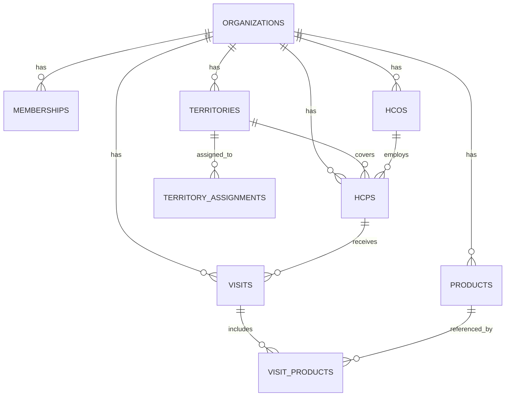

# Data Model

## Entity overview (Mermaid ERD — Phase 2 slice)

Full column-level schema lives in `supabase/migrations/20260807000001_core_schema.sql` (tables) and `20260807000002_rls.sql` (RLS policies + audit trigger) — treat those as the source of truth; this doc explains intent, not a duplicate of the SQL.

## Key modeling decisions
- **Multi-tenancy**: shared schema, every table carries `organization_id`, enforced by RLS — not schema-per-tenant, so it scales to thousands of orgs without per-tenant migration overhead.
- **Role resolution**: `memberships (user_id, organization_id, role)` is the single source of RBAC truth; `current_membership()` / `is_org_member()` / `is_manager_or_admin()` are `security definer` SQL functions used by every RLS policy so policies stay simple and consistent.
- **Territory-scoped visibility**: reps see HCPs via `territory_assignments`, not a direct `rep_id` on `hcps` — a rep's coverage can change without rewriting HCP rows.
- **`visits.client_id`**: a unique client-generated id (UUID from the offline IndexedDB queue) so a visit created offline and retried after a flaky sync never creates a duplicate row (upsert on conflict).
- **Audit log**: append-only, populated by a `security definer` trigger (not application code) so it can't be bypassed by a buggy or malicious client.

## Beyond the slice (documented, not built yet)
`tour_plans`, `targets`, `expense_claims`, `approvals` (generic state-machine table), `sample_inventory`, `stockists`, `orders` — each gets full schema when its module is built (see `06-roadmap.md`).
